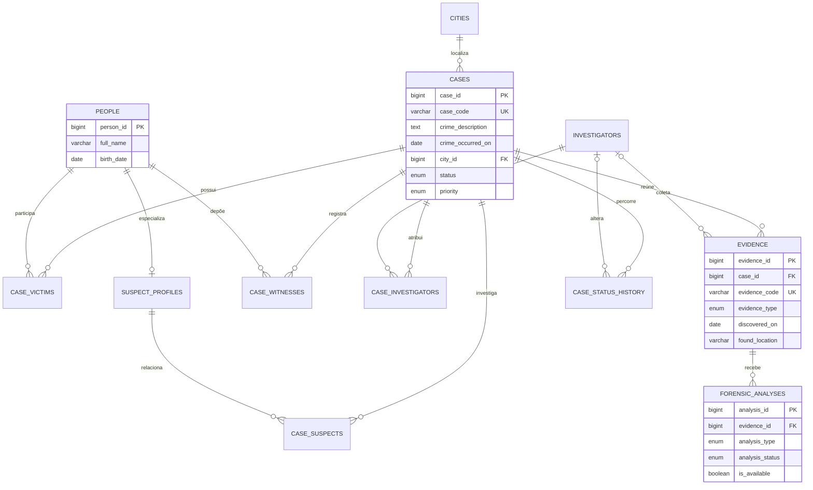

# Diagrama entidade-relacionamento

O diagrama mostra as entidades centrais. Tabelas associativas preservam papéis
distintos da mesma pessoa em cada caso e evitam duplicação de dados.

## Regras principais

- Um caso pertence a uma cidade e pode ter muitas vítimas, suspeitos,
  testemunhas, evidências, atribuições e mudanças de status.
- Uma pessoa pode aparecer em vários casos e até exercer papéis diferentes.
- Um item de evidência pode ter nenhuma, uma ou várias análises periciais.
- Um investigador pode atuar em vários casos; casos resolvidos são calculados
  pelo relacionamento, não digitados manualmente.

